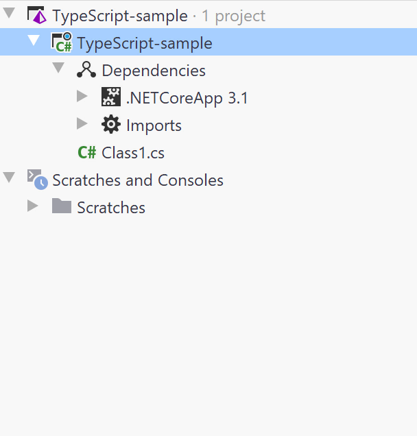

# # Testing with Mocha

[Mocha](https://mochajs.org/) is a feature-rich JavaScript test framework running on [Node.js](https://nodejs.org/en/) and in the browser, making asynchronous testing simple and fun. Mocha tests run serially, allowing for flexible and accurate reporting, while mapping uncaught exceptions to the correct test cases. Hosted on [GitHub](https://github.com/mochajs/mocha).

Project Configuration

You can use [npm](https://www.npmjs.com/) or [Yarn](https://yarnpkg.com/) to install any TypeScript or JavaScript library in the Terminal window in Rider. Alternatively, you can enter the package name and version into the package.json file. Add a `project.json` file to the project by using `Ctrl + N` and typing `package.json`.

