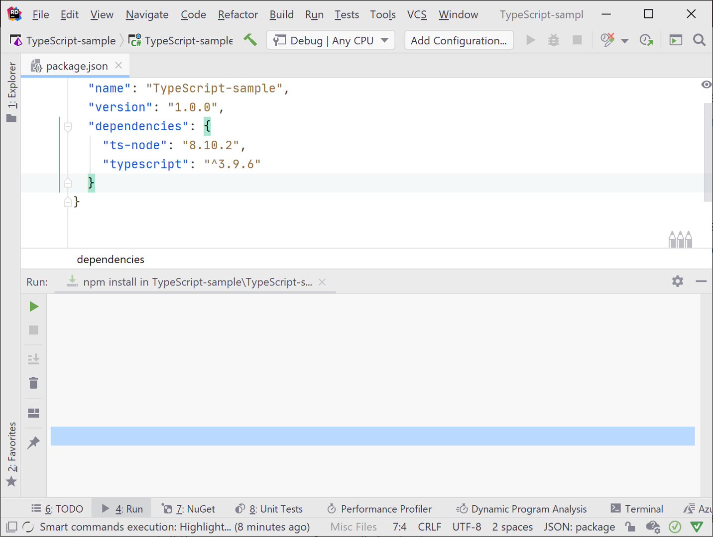

# Testing with Mocha

[Mocha](https://mochajs.org/) is a feature-rich JavaScript test framework running on [Node.js](https://nodejs.org/en/) and in the browser, making asynchronous testing simple and fun. Mocha tests run serially, allowing for flexible and accurate reporting, while mapping uncaught exceptions to the correct test cases. Hosted on [GitHub](https://github.com/mochajs/mocha).

## Project Configuration

You can use [npm](https://www.npmjs.com/) or [Yarn](https://yarnpkg.com/) to install any TypeScript or JavaScript library in the Terminal window in Rider. Alternatively, you can enter the package name and version into the package.json file. Add a `project.json` file to the project by using `Ctrl + N` and typing `package.json`.


Add the entries typescript and `ts-node` under the `dependencies` node, press `Alt+Enter`, and accept Rider’s suggestion to Run `npm install`. This adds the packages to a `node_modules` directory under your project. Using Rider’s built-in autocomplete features reduces typos and errors, making the experience smooth.




Install Mocha, Chai, and their TypeScript type libraries the same way. Their entries belong under the `devDependencies` node. Below is a sample using the latest version of the libraries at the time this article was published.

```javascript
"devDependencies": {
  "@types/mocha": "7.0.2",
  "@types/node": "14.0.11",
  "@types/chai": "4.2.11",
  "chai": "4.2.0",
  "mocha": "7.2.0"
}
}
```

Once configuration is complete, onto writing the tests and code!

## Write Unit Tests in TypeScript

The testing frameworks and the code you want to test must be imported. Import statements belong at the top of the file.

```javascript
import { describe } from "mocha";
import { expect } from "chai";
import { TaxCalculator } from "./taxCalculator";
```

Rider helps you by showing autocomplete options, then filling in the details, such as `TaxCalculator` for the class in the `taxCalculator.ts` file. All you do is start typing, and select an option.


In TypeScript, functions are contained within classes, but they may also stand alone. Mocha’s `describe` function allows you to group code together for testing – perhaps all the methods of a class, or a group of stand-alone functions. While it’s not mandatory, grouping related logic is quite useful and makes tests easier to maintain.

As an example, to group a `Calculator` class that contains `Add`, `Subtract`, `Multiply`, and `Divide` methods, add a `describe` function and supply a string value describing the group of tests. Additionally, it’s a good idea to add individual describe methods for each test or set of test cases within the group. The code will look similar to the following sample:

```javascript
describe('Calculations from Calculator class', () => {
  describe(‘add two numbers', () => {
    // test cases here
  });
  describe('subtract two numbers', () => {
    // test cases here
  });
  describe('multiply two numbers', () => {
    // test cases here
  });
  describe('divide two numbers', () => {
    // test cases here
  });
});

```

To write individual test cases, use Mocha’s `it` function and place the tests inside a describe function. Notice that the first argument in the `it` function is a string describing what the test does. Below is a `calculateTax` function and its companion test (in separate files):

```javascript
calculateTaxAmount(salePrice: number, taxRate: number) : number {
  return salePrice * (1 + taxRate)
}

describe('TaxCalculator', () =>
{
  describe('test calculateTaxAmount(salesPrice, taxRate)', () =>
  {
    it('should calculate the tax for an item', () =>
    {
      let taxCalculator = new TaxCalculator();
      expect(taxCalculator
      .calculateTaxAmount(25, .05))
      .to
      .equal(26.25);
    });
  });
});
```

Notice that the test is nested inside two `describe` functions. The outer is to describe all tests in this group and the inner describes the tests related to the specific function you’re testing.

Rider is great for building tests with test-first strategies in mind. Below is an example of creating the tests for `TaxCalculator.add` before `TaxCalculator.add` exists, then adding the code for `TaxCalculator.add`.


## Run TypeScript Tests

While you can use the test runner, Rider automatically recognizes unit tests and places a Run icon next to each test as well as their groups.

Notice there’s an arrow for each describe function so you can run the tests at the level you wish. Rider has options to run tests with coverage as well as with profiling, to meet all your testing needs.


Once you’ve completed testing, **export the test results to an HTML, XML, or custom format**. This is a great way to demonstrate your testing results to the boss.


## For people who like using cli :

```bash
mkdir app
cd app
npm init

```

Install with npm globally:

```bash
npm install --global mocha
```

or as a development dependency for your project:

```bash
npm install --save-dev mocha
```

**GETTING STARTED**

```bash
npm install mocha
mkdir test
$EDITOR test/test.js # or open with your favorite editor
```

In your editor:

```javascript
var assert = require("assert");
describe("Array", function () {
  describe("#indexOf()", function () {
    it("should return -1 when the value is not present", function () {
      assert.equal([1, 2, 3].indexOf(4), -1);
    });
  });
});
```

Back in the terminal:

```bash
 ./node_modules/mocha/bin/mocha

  Array
    #indexOf()
      ✓ should return -1 when the value is not present


  1 passing (9ms)
```

Set up a test script in package.json:

```javascript
"scripts": {
  "test": "mocha"
}
```

## Summary

There is much more you can do with Mocha and Chai, or any TypeScript unit testing framework you use that isn’t demonstrated here so start searching for new experience :-).

If You would like to watch a movie tutorial with using cli than https://www.youtube.com/watch?v=_56LSAV_hEA .
